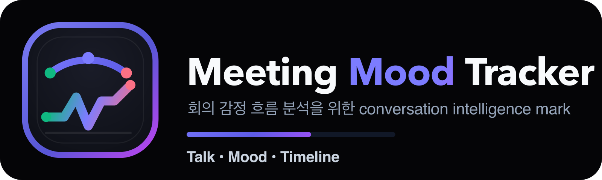

# Meeting Mood Tracker

[한국어](./README.md) | English



Meeting Mood Tracker is a conversation intelligence repository that stores meeting utterance data in a `project -> meeting -> agent -> turn` hierarchy and analyzes visual mood flow and meeting signals. The backend provides FastAPI services backed by Azure OpenAI analysis pipelines, while the frontend offers React Flow and Timeline views for exploring meeting dynamics.

## Why This Repo

- It tracks not only meeting-level summaries, but also turn-level mood flow and agent patterns.
- Its project-aware storage model lets you accumulate meeting data and reuse it through read APIs.
- It treats Korean-first meeting data and Korean/English code-switching as primary scenarios.
- Analysis results, inspect/debug paths, and visualization UIs are connected in one end-to-end flow.

## Highlights

- `POST /api/v1/analyze`
  - Analyze a full meeting transcript into topic / sentiment / emotion / correlation.
- `POST /api/v1/analyze/inspect`, `POST /api/v1/analyze/inspect/stream`
  - Trace analysis steps and logs through REST and SSE.
- `POST /api/v1/sentiment/turn`
  - Return a sentiment label and confidence for a single utterance turn.
- `POST /api/v1/projects/{project_id}/meetings/{meeting_id}/turns`
  - Save turn analysis results into the project-aware storage path.
- `GET /api/v1/projects/{project_id}/meetings/{meeting_id}`
  - Return meeting overview aggregates.
- `GET /api/v1/projects/{project_id}/meetings/{meeting_id}/turns`
  - Return turn lists for timeline and detail panels.
- `GET /api/v1/projects/{project_id}/meetings/{meeting_id}/agents`
  - Return agent aggregates and pattern summaries.
- React Flow board + Timeline page
  - Explore graph relationships and mood time-series in separate focused views.

## Tech Stack

- Backend: FastAPI, Pydantic, Python 3.12, uv
- LLM: Azure OpenAI, structured output(JSON schema)
- Frontend: React, Vite, Tailwind, React Flow, ApexCharts
- Storage: JSON repository-based project-aware storage
- Quality Gate: custom harness, Ruff, Pytest, Playwright

## Repository Layout

- `backend/`
  - FastAPI server, analysis services, repository layer, tests, Streamlit inspect UI
- `frontend/`
  - React dashboard, Flow board, Timeline UI
- `docs/`
  - Architecture, design principles, environment setup, and operations guides
- `data/`
  - Project-aware JSON storage data
- `scripts/`
  - Worktree setup and pre-commit helper scripts
- `frontend/public/brand/`
  - Logo, favicon, and brand assets

## Quick Start

### Prerequisites

- Python `3.12+`
- `uv`
- Node.js `18+`
- Azure OpenAI access
- Optional: Docker / Docker Compose

### 1. Prepare environment variables

```bash
cp backend/example.env backend/dev.env
```

Fill in `backend/dev.env` with:

- `LLM_API_KEY`
- `LLM_ENDPOINT`
- `LLM_MODEL_NAME`
- `LLM_DEPLOYMENT_NAME`
- Optional: `LLM_API_VERSION`, `LLM_MODEL_VERSION`

For the full loading rules, see [`docs/ENVIRONMENT_GUIDE.md`](./docs/ENVIRONMENT_GUIDE.md).

### 2. Prepare the worktree / local environment

```bash
./scripts/setup_worktree.sh
```

This script prepares the worktree-local `.venv` and also runs feature/issue synchronization.

### 3. Run the backend

```bash
./backend/scripts/run_api.sh
```

- Default port: `8000`
- Health check: `http://localhost:8000/healthz`

### 4. Run the frontend

```bash
cd frontend
npm install
npm run dev
```

Then open `http://localhost:5173` in your browser.

### 5. Quick verification

```bash
curl http://localhost:8000/healthz
```

Expected response:

```json
{"status":"ok"}
```

## Docker Development

Use the root-level `docker-compose.dev.yml` for local Docker development.

```bash
docker compose -f docker-compose.dev.yml up --build
```

Default ports:

- Backend: `http://localhost:8000`
- Frontend: `http://localhost:5173`

If this repository is used as a submodule in a parent repo, refer to [`docs/templates/docker-compose.parent.api.yml`](./docs/templates/docker-compose.parent.api.yml).

## Development Workflow

### Full initialization + baseline verification

```bash
./init.sh
```

This script performs the following steps:

- backend `uv sync`
- backend `ruff`, `pytest`
- frontend dependency installation
- development server startup guidance output

### Frequently used commands

```bash
# backend lint
cd backend && uv run ruff check .

# backend test
cd backend && uv run pytest tests/ -v

# frontend build
cd frontend && npm run build

# issue sync
cd backend && uv run python scripts/sync_feature_issues.py

# Streamlit inspect UI
./backend/scripts/run_ui.sh
```

## API Overview

The root README is intentionally kept as an onboarding overview. For detailed schemas and analysis definitions, see:

- [`backend/README.md`](./backend/README.md)
- [`docs/DESIGN.md`](./docs/DESIGN.md)
- [`docs/ARCHITECTURE.md`](./docs/ARCHITECTURE.md)

Core endpoints at a glance:

- `GET /healthz`
- `POST /api/v1/analyze`
- `POST /api/v1/analyze/inspect`
- `POST /api/v1/analyze/inspect/stream`
- `POST /api/v1/sentiment/turn`
- `POST /api/v1/projects/{project_id}/meetings/{meeting_id}/turns`
- `GET /api/v1/projects/{project_id}/meetings/{meeting_id}`
- `GET /api/v1/projects/{project_id}/meetings/{meeting_id}/turns`
- `GET /api/v1/projects/{project_id}/meetings/{meeting_id}/agents`

## Documentation Map

- [`docs/REPOSITORY_DETAIL.md`](./docs/REPOSITORY_DETAIL.md)
  - Draft copy for GitHub About / repository positioning
- [`docs/ENVIRONMENT_GUIDE.md`](./docs/ENVIRONMENT_GUIDE.md)
  - `dev.env`, `prod.env`, and `APP_ENV` loading rules
- [`docs/ARCHITECTURE.md`](./docs/ARCHITECTURE.md)
  - Layered architecture, storage model, read and analysis flows
- [`docs/DESIGN.md`](./docs/DESIGN.md)
  - Domain goals and API design principles
- [`docs/AGENT_OPERATIONS_GUIDE.md`](./docs/AGENT_OPERATIONS_GUIDE.md)
  - Agent / workflow operational rules
- [`docs/QUALITY_SCORE.md`](./docs/QUALITY_SCORE.md)
  - Harness, lint, and validator expectations

## Operational Notes

- Azure OpenAI firewall rules must allow access for live LLM calls to work.
- Self-harm, suicide, or hate-related expressions may trigger Azure Content Filter and result in `502` responses.
- Repository-wide documentation and operator-facing messaging follow a Korean-first principle.

## Contributing Notes

- In a new worktree or session, run `./scripts/setup_worktree.sh` first.
- Feature implementation follows `feature_list.json` and the GitHub issue synchronization rules.
- If architecture or functional contracts change, update `README.md` and `docs/` together.
